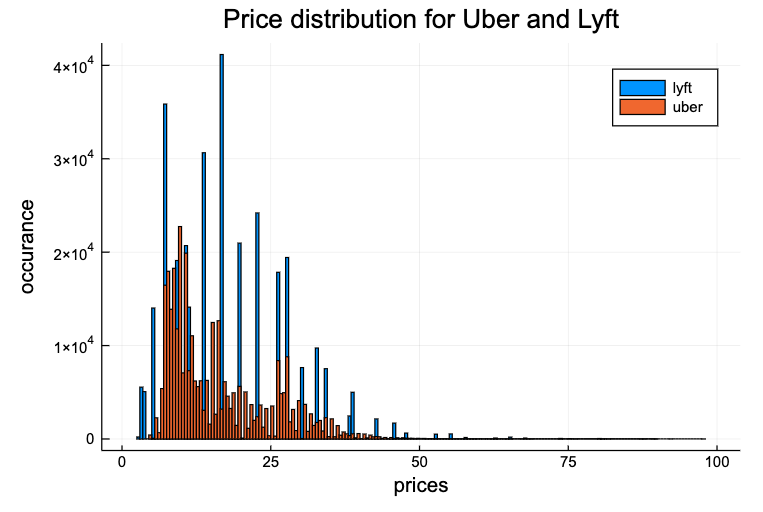
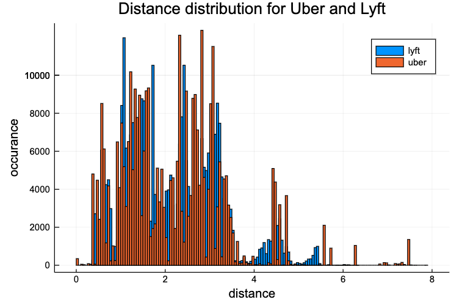
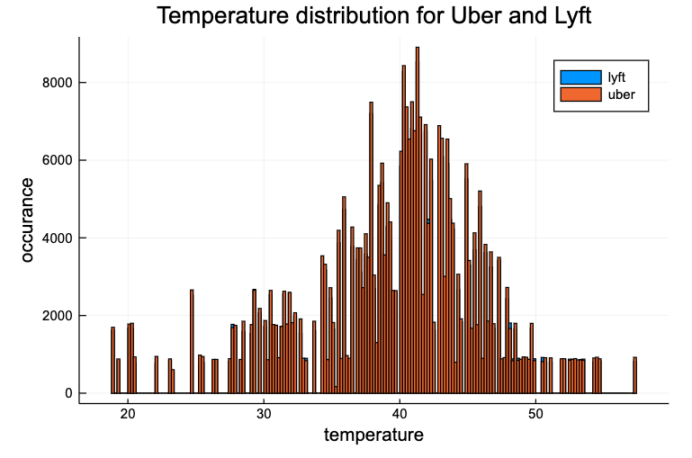
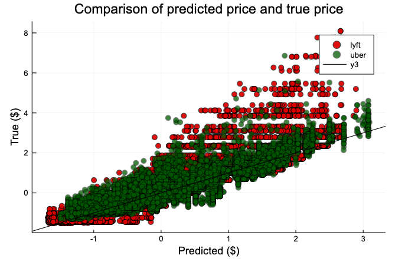
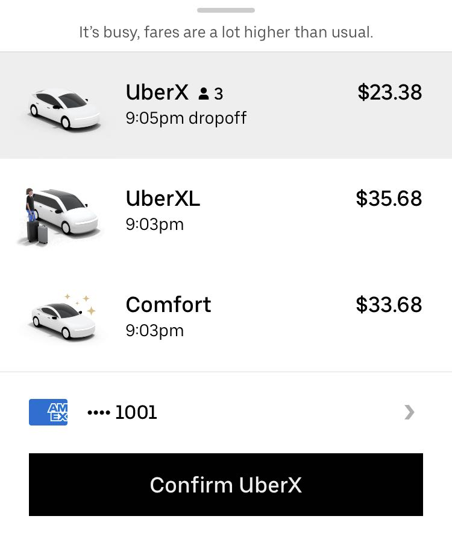

# Midterm Report

## Introduction

In the report, you should describe your data set in greater detail.

- [checked] Describe how you plan to avoid over (and under-)fitting, and
- [checked] how you will test the effectiveness of the models you develop.
- [checked] Include a few histograms or other descriptive statistics about the data.
- [checked] How many features and examples are present?
- [checked] How much data is missing or corrupted? How can you tell?
- [checked] You should also run a few preliminary analyses on the data, including perhaps some regressions or other supervised models, describing how you chose which features (and transformations) to use.
- [checked] explain what remains to be done
- [checked] how you plan to develop the project over the rest of the semester.

In this project, we look at what factors infuence the price of ride-sharing. Specifically, with the data on Uber and Lyft rides, we train a model that takes factors including the platform, time, day of the week, weather, distance, model of the ride, etc, to predict the price of the ride.

### The data

We have a sample size of 693,071, with 56% Uber rides and 44% Lyft rides during November to December, 2018 in Boston. There are 57 features in total. For a quick glance of the difference between pricing for each ride sharing platform, we plotted a histogram of price.

## Current progress

### Data cleaning

There are in total 55095 entries contain missing data, which comprises of 0.79% of all data. With the histogram and a look at the min and max values of each column, we believe that all other data are within reasonable range.
We split all data into two parts. 80% of data is training data and the rest is testing data.
We got rid of all missing values in the table and changed the datatype of one column from string to float. We also combined the columns "month" and "day" into one column "day_of_week", because we believe that the actual number of the date is not as indicative as the day of the week. We then standardized all real columns and used one-hot encoding for boolean and categorical data.

### Regression model

We trained a least squares linear model on the training data, and tested it on our test set. We calculated the train and test MSE to evaluate this model. We achieve a training MSE of 0.1069, and a test MSE of 0.1052.

We believe that this linear model works pretty well for our data, especially for Uber rides. According to the plot, datapoints of Uber rides cluster nicely around the regression line, and Lyft rides have larger absolute errors.
Because the test MSE is not higher than training MSE and they are both very small, we don't think the linear regression model overfits or underfits.

## Future plans

### What remains to be done

- The "name" feature describes the type of car of the ride, and its values are ["Lyft", "Shared", "Lux", "UberPool", "UberXL", "UberX", "Black SUV", "Lyft XL", "Lux Black XL", "Black", "Lux Black", "WAV"]. We believe that the type of the car definitely influence the price, as shown below.
  
  However, it is apparent that this feature is not independent of the platform. For example, if the name value is "UberX", then the "cab_type" ("Uber" of "Lyft") will definitely be "Uber".  
  We will change this feature to categorize it into three or four buckets. For example, both "Lyft" and "UberX" will be "regular", and "LyftXL" and "UberXL" will be "XL". In this way, this feature can still indicate the type of car and be independent of other features.
- We believe that the time duration of the ride will also influence the price. Currently, the data has a start time feature as well as an end time feature. We will combine these two to one feature of time lapse.
- Because the regression model shows different accuracy for Uber and Lyft, we might attempt to train two models on both dataset, to see if we will have better results.
- Because we have 57 features, we would like to figure out which ones are less influential to the price. The weight vector of the linear regression model has about 10 entries that is very close to 0. As we learned in class, the lasso model can produce a sparse solution, and we would attempt the lasso model, and see which features could be dropped.
- We also plan to try other models, include ridge regression and regression knn. If any of these model overfits, we will try to decrease the number of features.

### Timeline

| Plan                   | Deadline |
| ---------------------- | -------- |
| Further data cleaning  | 11/15    |
| Try Lasso model        | 11/22    |
| Attempt other models   | 11/29    |
| Solve overfit/underfit | 12/6     |
| Wrap up, final report  | 12/13    |
